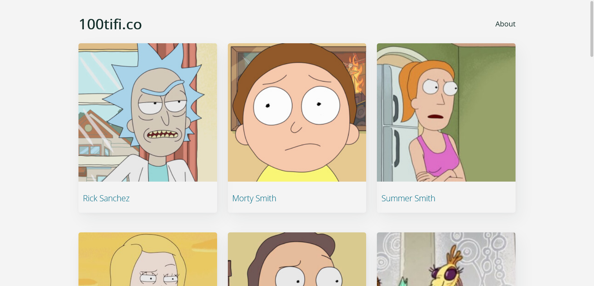

# 100tifico

## About the project

This project is called 100tifico. It is a Single Page Application (SPA) that shows information about characters from Rick & Morty using the Rick & Morty API https://rickandmortyapi.com/

Live: https://rodedd.github.io/spa-rickandmorty/

### Built with

- HTML
  - Semantic HTML
- CSS
  - Grid
  - Flexbox
  - Animations
- JavaScript
  - Vanilla JS
  - DOM Manipulation
  - Fetch API
  - Async / Await
- Babel
- Webpack
- Travis CI